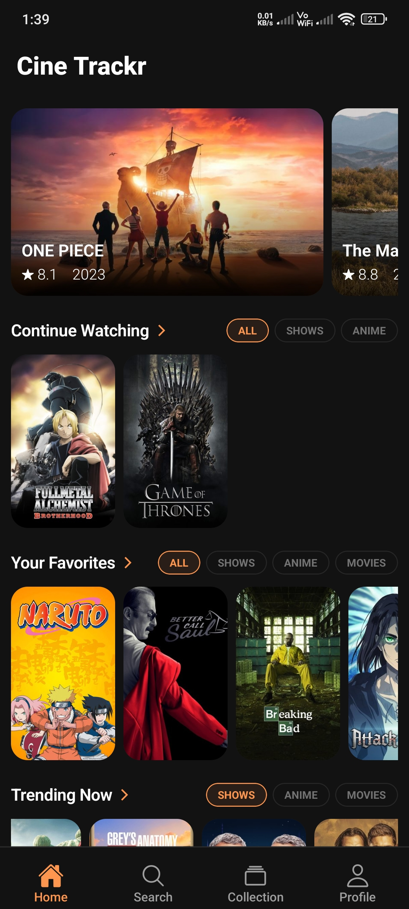
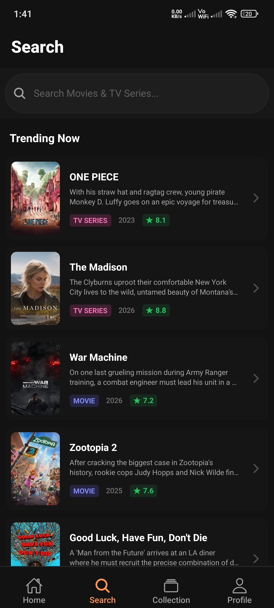
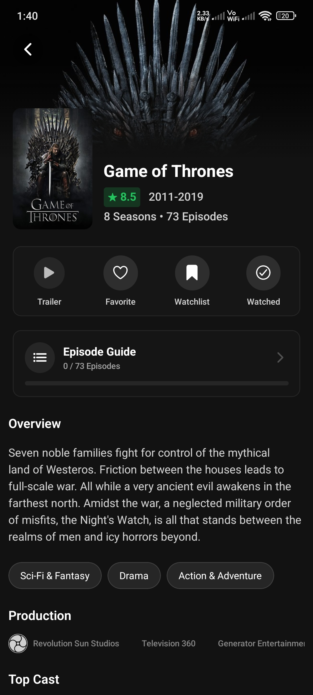
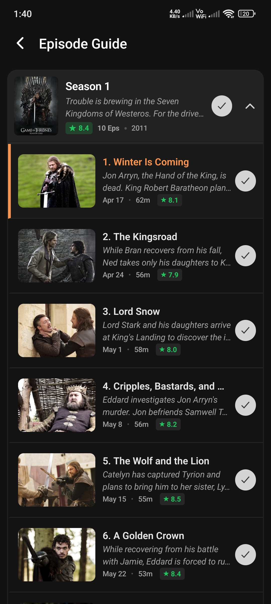
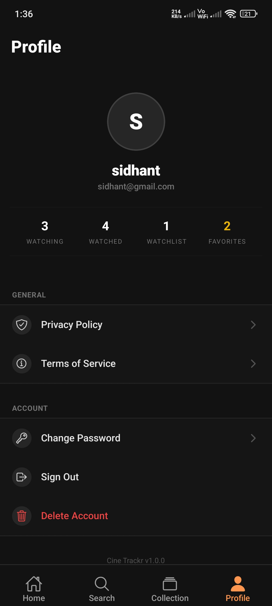
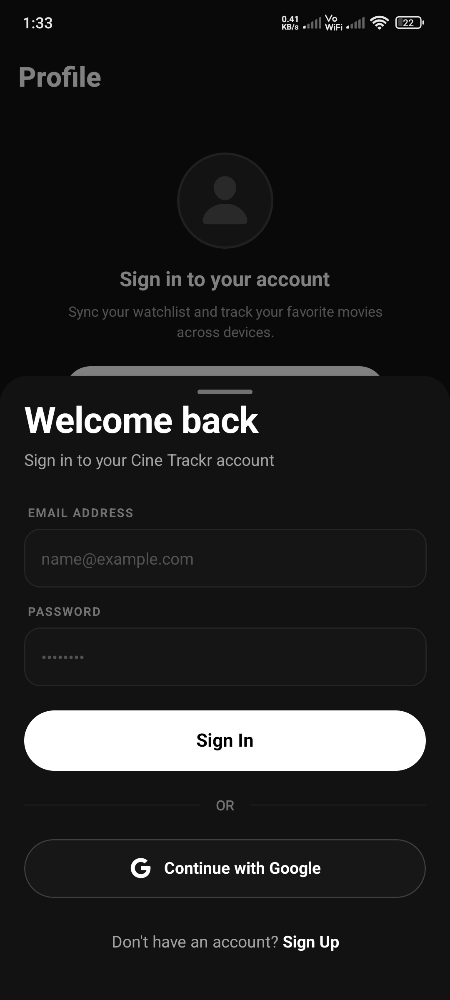

# Cine Trackr


Cine Trackr is a comprehensive, open-source utility application designed to help users organize, track, and discover movies and television series. It allows users to manage their watchlists, track episode progress, and seamlessly sync their data across devices.

## Table of Contents

<details>
<summary>Click to expand</summary>

- [Overview](#overview)
- [Screenshots](#screenshots)
- [Key Features](#key-features)
- [Technical Architecture](#technical-architecture)
- [Getting Started](#getting-started)
    - [Prerequisites](#prerequisites)
    - [Installation](#installation)
    - [Environment Configuration](#environment-configuration)
    - [Database Setup](#database-setup)
- [License](#license)

</details>

## Overview

The application serves as a centralized, ad-free hub for media enthusiasts to track their viewing progress without the clutter of traditional social media. Built with a focus on fast performance and data integrity, Cine Trackr utilizes the TMDb API for comprehensive media metadata and Supabase for secure backend authentication and database syncing.

---

## Screenshots

<div align="center">
  <table width="100%">
    <tr>
      <td width="33%" align="center">
        
        <br/><sub><b>Home Screen</b></sub>
      </td>
      <td width="33%" align="center">
        
        <br/><sub><b>Search Screen</b></sub>
      </td>
      <td width="33%" align="center">
        
        <br/><sub><b>Detail Screen</b></sub>
      </td>
    </tr>
    <tr>
      <td width="33%" align="center">
        
        <br/><sub><b>Episode Guide</b></sub>
      </td>
      <td width="33%" align="center">
        
        <br/><sub><b>User Profile</b></sub>
      </td>
      <td width="33%" align="center">
        
        <br/><sub><b>Sign In Screen</b></sub>
      </td>
    </tr>
  </table>
</div>

---

## Key Features

- **Media Discovery:** Search and browse trending movies and television series through a seamless integration with the TMDb API.
- **List Management:** Track what you are currently watching, have finished, or plan to watch later.
- **TV Show Tracking:** Detailed episode guides with dynamic accordion UI to track exactly which season and episode you are currently watching.
- **Secure Authentication:** Robust user authentication utilizing Google OAuth and Supabase Auth.
- **Over-The-Air Updates:** Update checker that prompts users to download the latest version from GitHub when a mandatory update is available.

## Technical Architecture

### Frontend

- **Framework:** React Native with Expo
- **Language:** TypeScript (Strict Mode)
- **Navigation:** Expo Router (File-based routing)
- **Styling:** NativeWind (Tailwind CSS implementation for React Native)
- **State Management:** Zustand & TanStack Query (Server State / API Caching)

### Backend

- **Platform:** Supabase
- **Database:** PostgreSQL with Row Level Security (RLS)
- **Authentication:** Supabase Auth (Email/Password & Google OAuth)

### Data Sources

- **Media Metadata:** TMDb (The Movie Database) API v3

## Getting Started

### Prerequisites

- Node.js (version 18 or higher recommended)
- A Supabase API key
- A TMDb API key
- Google Cloud Console configured for OAuth (Optional, for Google Sign-in)

### Installation

1. Clone the repository:
    ```bash
    git clone https://github.com/SidhantSamant/cineTrackr.git
    cd cineTrackr
    ```
2. Install dependencies:
    ```bash
    npm install
    ```
3. Generate the native Android and iOS project files:
    ```bash
    npx expo prebuild
    ```

### Environment Configuration

Create a `.env` file in the root directory based on `.env.example`. Required variables include:

- `EXPO_PUBLIC_SUPABASE_URL`: Your Supabase project URL.
- `EXPO_PUBLIC_SUPABASE_ANON_KEY`: Your Supabase anonymous API key.
- `EXPO_PUBLIC_TMDB_KEY`: Your TMDb API key.
- `EXPO_PUBLIC_GOOGLE_ANDROID_CLIENT_ID`: Your Google OAuth client ID for Android.
- `EXPO_PUBLIC_GOOGLE_WEB_CLIENT_ID`: Your Google OAuth client ID for Web.

### Database Setup

To initialize the database, execute the SQL scripts located in `supabase-scripts` within the Supabase SQL Editor. This will creates your database tables and sets up strict privacy rules using Row Level Security (RLS).

### Running the Application

Since Cine Trackr uses custom native modules, the standard Expo Go app cannot be used. You must compile a development build.

**For Android:**
`npx expo run:android`

**For iOS (Requires a Mac):**
`npx expo run:ios`

## License

This project is open-source and licensed under the GNU General Public License v3.0 (GPLv3).
